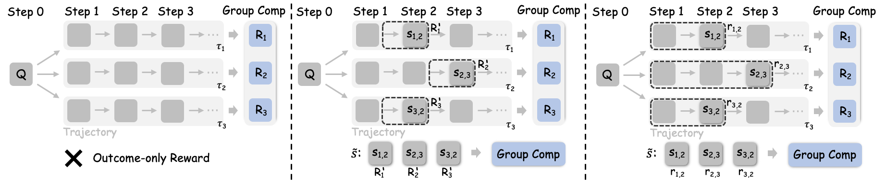
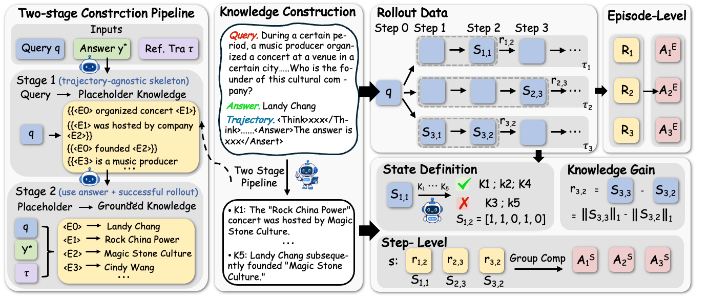
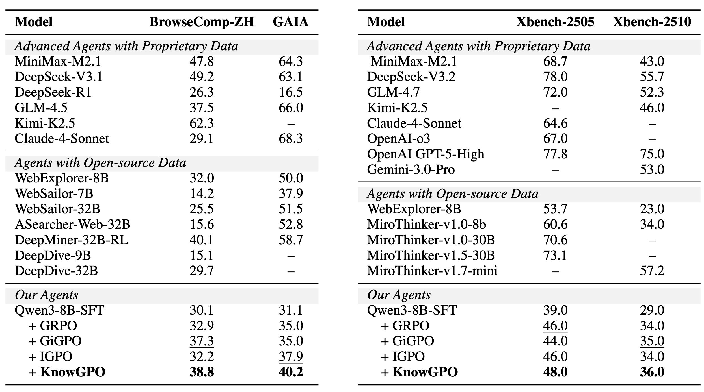

<h1 align="center">
  <!-- <br> -->
  KnowGPO
</h1>
<h3 align="center"><em><ins>Know</ins>ledge-<ins>G</ins>rouped <ins>P</ins>olicy <ins>O</ins>ptimization for Search Agents</em></h3>

<p align="center">
  <a href="#"></a>
  <!-- <a href="#"></a>
  <a href="#"></a>
  <a href="#"></a> -->
</p>

<p align="center">
  Siqi Chen<sup>1,2</sup>, Zhengxi Lu<sup>1</sup>, Yuchen Yan<sup>1</sup>, Xingyu Wu<sup>1,2</sup>,
  Qipeng Chen<sup>1</sup>, Xin Zhang<sup>2</sup>, Aiting Liu<sup>2</sup><br>
  Chao Deng<sup>2</sup>, Jie Liu<sup>2</sup>,Jin Ma<sup>2</sup>,Weiming Lu<sup>1</sup>,Jun Xiao<sup>1</sup>,Yongliang Shen<sup>1&dagger;</sup>
</p>

<p align="center">
  <sup>1</sup> Zhejiang University &nbsp;&nbsp;&middot;&nbsp;&nbsp;
  <sup>2</sup> Tencent. &nbsp;&nbsp;&middot;&nbsp;&nbsp;
  <sup>&dagger;</sup> Corresponding author
</p>

## 🔥 Overview
We introduce **KnowGPO**, a Knowledge-Grouped Policy Optimization framework designed for deep search agents.
<div align="center" style="display:flex; justify-content:center; gap:20px; align-items:flex-start;">
  <!--  -->
  
</div>

## 🎉 News
- **2026.08.21:** Our paper has been accepted at EMNLP 2026 Main Conference 🎉🎉🎉!

## 🌟 Highlights

- **Knowledge-state abstraction instead of surface observation matching.** KnowGPO groups trajectories by verified task-relevant knowledge conditions, achieving 97.8% effective step alignment vs. 51.8% for observation-based grouping.
- **Environment-grounded process rewards.** Incremental knowledge gain provides dense step-level supervision without learned critics, observation matching, or reliance on model confidence.
- **Strong deep search performance.** KnowGPO reaches 48.0% on Xbench-2505, 38.8% on BrowseComp-ZH, and 40.2% on GAIA with Qwen3-8B, matching or surpassing 32B open-source systems.

## 🤖 Method

<p align="center">
  
</p>

KnowGPO operates through three key components:

1. **Knowledge Condition Construction.** A two-stage pipeline decomposes each query into atomic knowledge conditions: Stage 1 extracts the reasoning skeleton with entity placeholders; Stage 2 grounds placeholders using the reference answer and a successful trajectory.

2. **Knowledge State Representation.** At each step t, an LLM verifier checks which conditions are satisfied by the cumulative history. The knowledge state s_{i,t} is a binary vector indicating acquired conditions, updated monotonically to absorb transient noise.

3. **Knowledge-Grouped Credit Assignment.** Steps sharing the same prior knowledge state are grouped. Episode-level advantages capture final outcomes; step-level advantages are computed by normalizing incremental knowledge gain (||s_{i,t}||₁ - ||s_{i,t-1}||₁) within each group. The two are combined with mixing coefficient ω.

## 📊 Performance

<p align="center">
  
</p>

KnowGPO consistently outperforms outcome-only and process-supervision baselines across three challenging deep search benchmarks. On BrowseComp-ZH, it achieves 38.8% (+5.9% over GRPO), matching the 32B DeepMiner-RL agent. On GAIA, it reaches 40.2% (+5.2% over GRPO), surpassing all tested process-supervision methods. On Xbench-2505, it improves to 48.0%, outperforming GRPO, GiGPO, and IGPO while using an 8B backbone.

<!-- <p align="center">
  
</p>

Training dynamics show KnowGPO opening a clear gap over baselines by step 20 and maintaining consistent improvement throughout training, suggesting that knowledge-grouped credit assignment provides denser supervision across the entire learning process. -->

## 🔖 Repository Layout

```text
knowgpo/                          # KnowGPO core: knowledge state and grouping logic (code release coming soon)
assets/                           # Figures, logos, and visualization resources
```

## 🤝 Acknowledgement

This project builds on [veRL](https://github.com/volcengine/verl), [IGPO]((https://github.com/GuoqingWang1/IGPO)), [BrowseComp-ZH](https://huggingface.co/datasets/PALIN2018/BrowseComp-ZH), [GAIA](https://huggingface.co/gaia-benchmark), [BrowseComp-ZH](https://huggingface.co/datasets/PALIN2018/BrowseComp-ZH), and [Xbench](https://github.com/xbench-ai/xbench-evals). We thank the authors of those projects.
